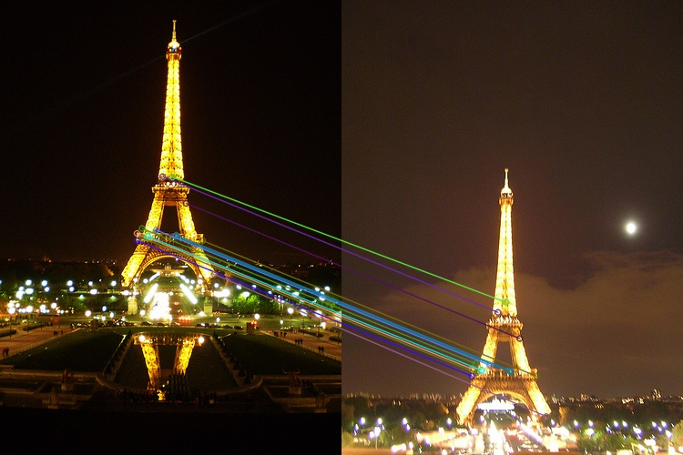
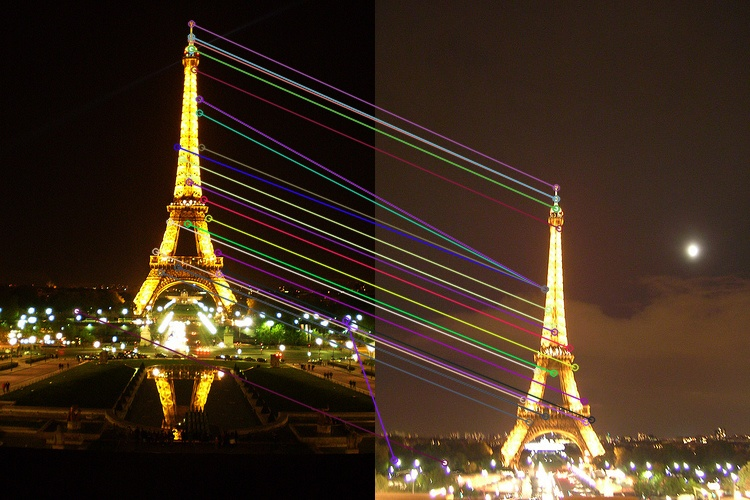
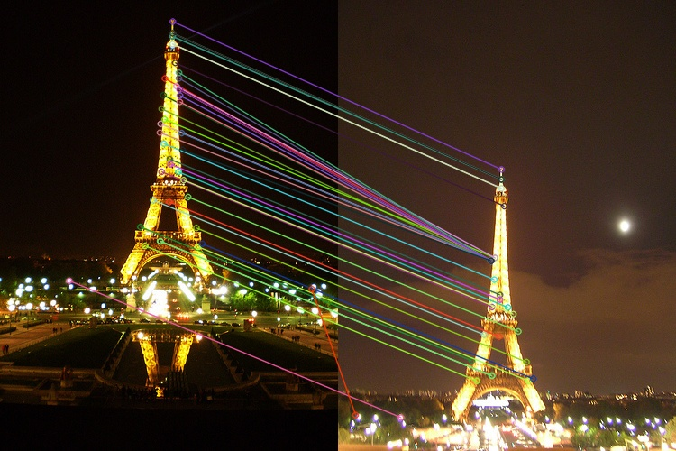
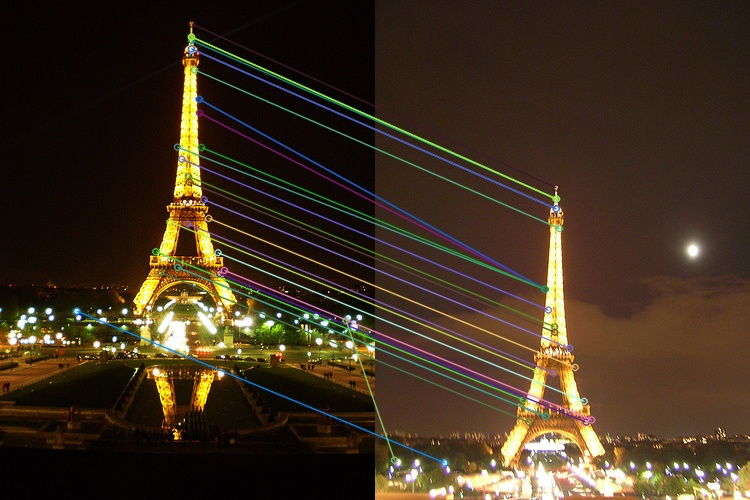
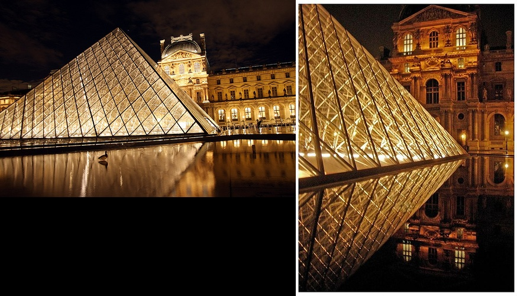
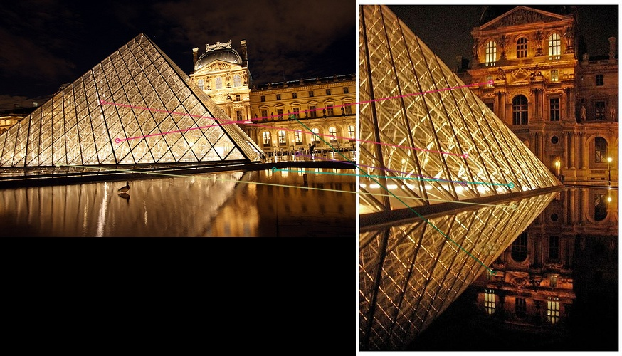
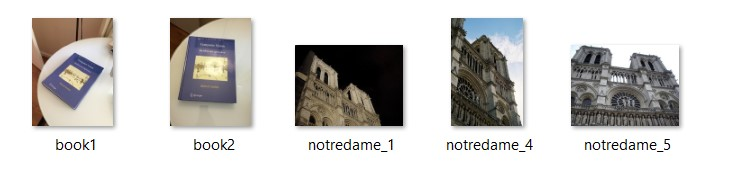

# a2

# Part 1:Image matching and clustering:

### Methods
#### 1)Feature matching Function  (ORB/SIFT Function):
- To tackle above problem, we have declare extract_features function it takes two images, total number of matching features.Functions checks the two images side by side with the extraction of pair of similar feature points from these two images .
- In OpenCV ,you do have different feature matching methods to get the desire results.we have tried using SIFT and ORB.

###### ORB:
- Here we use Oriented FAST and Rotated BRIEF (ORB) detector for the detecting the features.At first we have taken two images.we have created orb detector with cv2.ORB_create().
```python
    def extract_features(img1, img2):
        '''
        Input: 
            img1     :   <Image1>
            img2     :   <Image2>
        Output: 
            len(good):   <number of good matches>
    
```
- After we required to detect the  keypoints and descriptors.For orb.detectAndCompute() ,we have 2 parameters image and mask.As mask is not reuired we left it at None.For matching we have decided that we will go with Brute-Force matching.
- We are checking occurrence of matche,we are passing descriptors of both images in the bf.knnmatch() function.the third parameter k ,it is number which gives k best matches.
- After that we have compare the distance by David Lowe’s ratio test.


```python
good = []
    for m, n in matches:
      if m.distance < D*n.distance:
        good.append([m])
```
- For our case we realize than D value between 6.7 to 7.7 has given us good matches.
<div align="center">
      	
      </div>
	  
- Above image has D = 7.30(we think it will be best value for D as after that matches are not that accurate.i.e. tested with other images also.).The total we got 13 nearly accurate matches for given image.For n value we saw that 1000 will be good value for accuray.
- At the end we have taken len(good).


###### SIFT with Brute-Force Matching:
- extract_features Function for this is nearly identical to the orb extract_features except instead of ORB_create we have SIFT_create.
- In the case of David Lowe’s ratio test, for SIFT we realize than D value between 5.0 to 7.0 has given us good matches.
- The best accuracy for most of test images we got is at D = 0.566.
- SIFT with D =0.566
<div align="center">
      	
      </div>
- SIFT with D =0.75
<div align="center">
      	
      </div>
      
- For given image we got 28 matches in which most of them are accurate.(identical to the Figure 1: Sample visualization of SIFT matches.)with n= 700.Increasing D value after this has given poor extra matches.
 
###### SIFT with FLANN based Matcher:
- For this case accuracy was just like Sift but we did not see much improvement in speed.
<div align="center">
      	
      </div>


- By analysing all above methods we came to conclusion that  SIFT with Brute-Force Matching with D = 0.566 and n = 700 to 1000 has given us great results.ORB's results were not that accurate as incease in D value It might be because images are in different angles or their are same kind of similarity between two pixel.In below case Sift has given no matches while there are some wrong matches given by ORB.For below image it is understandable that getting correct matches are quite diffcult as both images are in totally unqiue angle and backward of img2 is shaded.
- SIFT 
<div align="center">
      	
      </div>
- ORB
<div align="center">
      	
      </div>


#### 2)A simple image clustering :
- In this part we check following different clustering algorithm.
###### AgglomerativeClustering for very small dataset:
- In this clustering algorithm we merges data or pair of same with the use of linkage distance.
- In this case for very small dataset of 5-6 images with two-three cluster their was wrong pairing for one to two images.
<div align="center">
      	
      </div>
	  
-######Clustering labels :[0 1 0 0 0]#######
- Changing parameter linkage‘ward’ to ‘average’ does not make much difference.But for complete and single we got different clustering results for most of the cases.
	
###### DBSCAN for very small dataset:
- It is a density-based algorithm.We can use this for clustering distance martix.
- For very same dataset DBscan has given us nearly or totally accurate clusters with shift with Brute-Force Matching.(There was 1 error for 1 set of data)
- Their was decrease in accuracy when grayscaling is perform on image.
- ####### Clustering labels :[-1 -1  0  0  0] (For above case)######
######  AgglomerativeClustering for whole dataset:
- For whole dataset AgglomerativeClustering doesn't provide us good results for optimal our setting of shift.But changing the value of d to 0.75 there was some improvement of results.This might be because some values change in array to 0 to some number.This creates some similarity between images which are likely going give matched.This also introduce more errored matches which might be on some similar images or not. 
- By grayscaling their was increase in number of features matches with ORB function. 
######  DBSCAN for whole dataset:
- Results given by DBSCAN are very poor in case of whole dataset.It might be due to Curse of dimensionality

###### SpectralClustering  for whole dataset:
-Results given by SpectralClustering is overall better than other.


###### Function for getting name of cluster in file:
- This function writes the names of images in the cluster.
```python
    def out_file_formatting(img_names, cluster_labels, out_file, k):
        '''
        Input: 
            img_names     :   Name of images
            cluster_labels:   array which contains information of Clustering labels 
			out_file      :   Output file
			k             :   no of clusters
       
```
##### 3) Selection of Clustering algorithm and accuracy :
- We have decided to select AgglomerativeClustering with SIFT with Brute-Force Matching having d = 0.75 and n = 800
- We got accuracy = 0.5
- We got  some  images in wrong clustering it might be due to so matching points as images are in different angle.Repeation of some structure can be one of the reason for this.
- Some images are in total different angle thats why they did not come under any group ressulting in forming their own cluster.


## Future Scope:
- We like to try other like LoFTR and check its accuracy with SIFT and ORB.
- Improving the performance for part1


# Part2 :Image Transformation 

Problem faced:
While performing the transformation on image, without any interpolation, We found out that there are black patches or lines on image. We figured out that this is due to no pixel values present at a particular coordinate. For example if we consider a simple scaling transformation of 3x in x. (1,0),(2,0) pixel will be converted to (3,0),(6,0). The pixels inbetween, (4,0),(5,0) have no value and become 0/dark. Due to this, There were black patches in the transformed image. To oevercome this problem, We used interpolation. We considered 4 nearest neighbours and calculated the pixel values of the neighbours according to the formula Value at (a,b) based on four neighbours= (1-b)(1-a)F(0,0)+ (1-b)(a)F(1,0)+(b)(1-a)F(0,1)+(b)(a)F(1,1)


Result
For 2.1
In the first part, we loaded an image, and a 3*3 transformation matrix was given.
I created a function called transformation where I perform matrix multiplication for each co-ordinate of an image (converted in homogeneity form) with inverse transformation matrix(depending if its euclidean, translation, affine or projective) which is 3*3 size

Before applying any transformation, one transformation matrix was given which need to be applied in lincoln image.
Result are given below:
 
 

## For n=1 (Translation Transformation)
## A translation slides an object a fixed distance in a given direction.  The original object and its translation have the same shape and size, and they face in the same direction.  It is a direct isometry.

In simple words, translation means, it just moves the given figure without rotating, re sizing or anything else.
transformation matrix =[1 0 tx <br />
 			0 1 ty <br />
 			0 0 1] <br />

 
 
 


Ref:https://www.onlinemath4all.com/translation-transformation-matrix.html
 
## For n=2 (Euclidean Transformation)
## A Euclidean transformation matrix that can perform both rotation and translation but contains an additional row and and an additional column:
transformation matrix = [[cos, -sin, tx], <br />
	     		[sin, cos, ty], <br />
	     		[0, 0, 1]] <br />


 
 
 

## For n=3 (Affine Transformation)
## Affine transformations are combinations of linear transformations (rotation, scaling, shear, mirror) and translations

transformation matrix =[[x1’, y1’, 1],    <br /> 
			[x2’, y2’, 1],    <br />
			[x3’, y3’, 1]]    <br />
			*
			[[x1, y1, 1],     <br />
			[x2, y2, 1],      <br />
			[x3, y3, 1]]^ (-1)<br />

 
 
 			

## For n=4 (Projective Transformation)
## Projective transformations are combinations of affine transformations and projective warps
transformation matrix =[[[x1, y1, 1, 0, 0, 0, -(x1 * x1'), -(y1 * x1')], <br />
		   [0, 0, 0, x1, y1, 1, -(x1 * y1']), -(y1 * y1')], <br />
		   [x2, y2, 1, 0, 0, 0, -(x2 * x2'), -(y2 * x2')], <br />
		   [0, 0, 0, x2, y2, 1, -(x2 * y2']), -(y2 * y2')], <br />
		   [x3, y3, 1, 0, 0, 0, -(x3 * x3'), -(y3 * x3')], <br />
		   [0, 0, 0, x3, y3, 1, -(x3 * y3']), -(y3 * y3')], <br />
		   [x4, y4, 1, 0, 0, 0, -(x4 * x4'), -(y4 * x4')], <br />
		   [0, 0, 0, x4, y4, 1, -(x4 * y4']), -(y4 * y4')]] <br />
		   

 
 
 		   

Future Improvement: Rather than formula using formula for bilinear interpolation, we can use convolution to perform interpolation
									[
			

# Part 3 
Problem statement is to extract information from two images and combine them in such a way that the combined image contains collective information from both the images. 
Algorithm:
1) 2 images will be provided as input. Feature points are detected from both the images using ORB. Feature points are the pixels that uniquely identify an image. 
2) Feature points from one image are matched with feature points of another image, Trying to find similar features. Hamming distance is used as distance metric. 
3) Once we get the matching feature points, We try to find the transformation matrix that might have transformed img1 to img2. Idea is to find the way img2 is transformed from img1 it could be rotation, scaling, translation or even affine transformation. So, At max 8 variables in the transformation matrix can be configured, So, We need 4 best matching feature points to compute the transformation matrix. 
4) RANSAC is a general technique which is used to remove outliers and find the best evidence out of all the data. RANSAC is implemented for this particular usecase, Using the matching features. So, For each match, We can see the distance between image cordinates in img1 to img2 this gives us an idea of how much shift might have happened. If the shift is similar to other translations, Then it means that all these are inliers in the data. Using this technique and after randomly picking hypothesis and evaluating voting, We found the best transformation matrix. 
5) Transformation matrix is applied onto img1 to convert both images to same coordinate system and them additional information from images is stiched together. 

Problems faced:
It is hard to analyse/correlate the relationship between projective transformation and the corresponding transformation matrix. We couldn't properly debug as to why a particular transformation matrix is leading to a particular result. We have tested the same RANSAC implementation with different use case, It is working fine, But it fails to find the proper transformation matrix with images. Why a particular transformation matrix is resulting in a particular  view is hard to analyse visually. So, We couldn't debug the solution. 

ORB is like a blackbox, We have seen few feature points wrongly getting matched. We tried different parameter tuning but, couldn't get to a near perfect results. 


